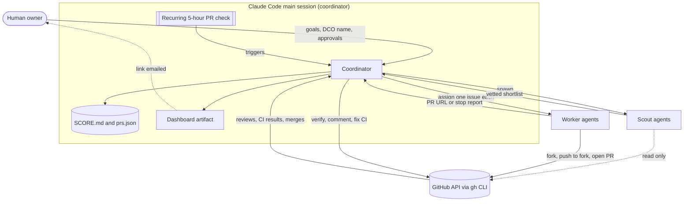
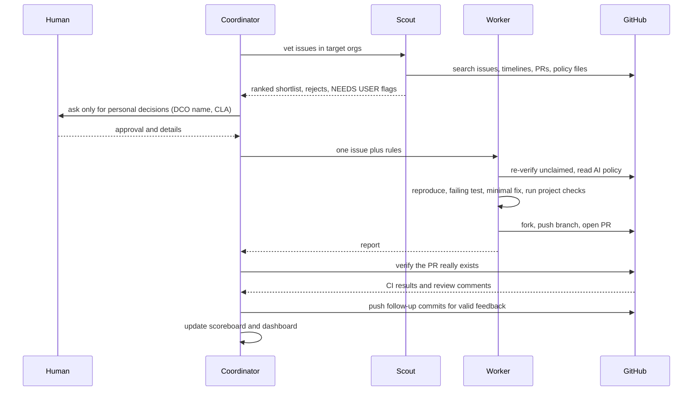

# oss-bug-hunt

A human-supervised, multi-agent workflow for finding real bugs in open-source projects, fixing them with tests, and opening pull requests that maintainers can actually review.

It was built around one lesson: **browsing "good first issue" lists does not work any more.** On popular repositories other contributors (and bots) claim every easy issue within hours. What works is verifying first, then fixing: check that an issue is really unclaimed, check that the project accepts AI-assisted work, reproduce the bug, and only then write code.

> **Status:** 12 pull requests opened across 9 projects in about one day. **0 merged so far**, 12 open. Merging is up to maintainers, and this repo reports the score honestly. See [`SCOREBOARD.md`](SCOREBOARD.md) for the live table.

## Contents

- [What it does](#what-it-does)
- [System architecture](#system-architecture)
- [How a contribution flows](#how-a-contribution-flows)
- [The agents](#the-agents)
- [Safety and quality rules](#safety-and-quality-rules)
- [Where bugs come from](#where-bugs-come-from)
- [Results so far](#results-so-far)
- [What worked and what did not](#what-worked-and-what-did-not)
- [Repository layout](#repository-layout)
- [Running the tools](#running-the-tools)
- [Limitations](#limitations)

## What it does

1. **Scouts** search for candidate bug issues in projects that accept outside contributions, and reject anything claimed, already fixed in a PR, or hostile to AI-assisted contributions.
2. **Workers** (one per issue) re-check the issue, reproduce the bug, write a failing test, make the smallest fix, run the project's own checks, and open one PR.
3. A **coordinator** (the Claude Code main session) verifies every PR against GitHub, fixes CI and review feedback, keeps a scoreboard, and decides what needs the human.
4. A **scheduled check** re-reads every PR every five hours. Scoring: merged = +1, rejected/closed = -1, open = 0.

A human stays in the loop for anything personal or legal: DCO sign-offs, CLAs, and projects that require a human to review PR text.

## System architecture



**Components**

| Component | Role | Notes |
|---|---|---|
| Coordinator | Plans, spawns agents, verifies results, fixes CI/review feedback, updates the scoreboard | The Claude Code main session. Never trusts an agent's report without checking GitHub. |
| Scout agents | Find and vet candidate issues | Read-only. Never fork, comment, or open PRs. |
| Worker agents | Fix one issue and open one PR | Run in isolated working folders (`~/oss/<name>`), push only to the user's fork. |
| `gh` CLI | All GitHub access | Searching, forking, PRs, issue timelines, CI status. |
| Scheduler | Fires the PR check every 5 hours | A session-level cron job (expires after 7 days). |
| Scoreboard | `SCOREBOARD.md`, `prs.json`, `tools/pr_status.py` | Computes merged / rejected / open and the total. |
| Feedback watcher | `tools/pr_watch.py` | Detects new human comments, change requests, failing CI, merges and closes. Writes reply drafts; posting is explicit. |
| Dashboard | A single static HTML page (`dashboard/index.html`) | Republished after each update. |

**Why scouts and workers are separate.** Scouting is cheap and read-only, so it can be broad and wrong without harm. Writing code and opening PRs is outward-facing, so only candidates that survived vetting get a worker, and each worker gets exactly one issue. This also keeps two agents from ever editing the same files.

## How a contribution flows



**Worker checklist (applied to every issue)**

1. Re-verify the issue is open, unassigned, with no claim comment and no linked PR (`gh pr list --search`, issue timeline).
2. Read `CONTRIBUTING`, `AGENTS.md`, `CLAUDE.md`, the PR template, and **`.github/AI_POLICY.md`**. Stop if the project bans or restricts AI-assisted PRs.
3. Follow claim-first or approved-issue-first rules.
4. Reproduce the bug; write a test that fails before the fix and passes after.
5. Make the smallest correct change in the project's style; run the project's tests, lint, format, and type checks the way its CI does.
6. Fork, branch, commit with required trailers (`Co-Authored-By`, `Signed-off-by` when DCO applies), push to the fork only, open the PR.
7. Write a truthful PR description: problem, repro, fix, tests run, **what was not verified**, and an AI-assistance disclosure.
8. Watch the first CI run and fix failures caused by the change.

## The agents

Prompts are in [`agents/`](agents):

- [`agents/scout_prompt.md`](agents/scout_prompt.md): vetting criteria (unclaimed, reproducible, small, AI policy, DCO/CLA, merge speed).
- [`agents/worker_prompt.md`](agents/worker_prompt.md): the one-issue, one-PR procedure.
- [`agents/RULES.md`](agents/RULES.md): the shared operating rules.

Workers are told to **stop and report** instead of forcing a weak PR. Several of the most useful outcomes were stops: an agent that found a project banning agent-authored PRs, and agents that found a claimed issue, each saved a rejected PR.

## Safety and quality rules

- **One verified PR per issue.** No filler, mass, or empty commits. Quality over volume.
- **Check before writing code.** Existing PRs, claims, assignees, and AI policy are re-checked immediately before each worker starts.
- **Respect project policy.** Projects that ban or restrict AI contributions (for example scikit-image, networkx, django-modern-rest) were skipped even when a real bug was found.
- **No signing for the human.** A DCO `Signed-off-by` is a legal statement, so it is only added with the owner's explicit agreement and legal name. CLAs are never signed by an agent.
- **Disclose AI assistance** in every PR, and do not tick checklist items that were not done.
- **Be truthful about gaps.** Every PR states what was not run or verified.
- **No pinging maintainers.** Replies happen only to review feedback, and politely.
- **Replies are drafted automatically but posted deliberately.** `tools/pr_watch.py` finds feedback and prepares a draft, a person (or the coordinator, after reading the comment) writes the reply, and `--post` sends it. There is no fire-and-forget auto-reply, because a wrong reply on someone else's project can get a PR closed.
- **Verify agent reports.** The coordinator confirms every claimed PR exists on GitHub before recording it.

## Where bugs come from

Browsing issue trackers is saturated, so the workflow uses several sources:

1. **Self-found bugs** from `audits/`: run the library and compare against ground truth. Example: [sktime/skpro#1200](https://github.com/sktime/skpro/pull/1200), where a numerical derivative lacked a division by the step size.
2. **Fresh maintainer-filed bugs** (hours old) with no comments or PRs, often in projects whose `AGENTS.md` welcomes AI agents.
3. **Test suites and doctests on a new Python** (3.14) to find unreported failures.
4. **Scout vetting** across Linux Foundation, CNCF, and Google Summer of Code organisations.

| Script | Target | What it checks |
|---|---|---|
| [`audits/distribution_consistency.py`](audits/distribution_consistency.py) | skpro | mean, variance, cdf, energy vs Monte Carlo |
| [`audits/metric_reference_check.py`](audits/metric_reference_check.py) | sktime | forecasting metrics vs textbook formulas |
| [`audits/splitter_invariants.py`](audits/splitter_invariants.py) | sktime | window splitter invariants |

## Results so far

All open, none merged, as of the latest check (details and live status in [`SCOREBOARD.md`](SCOREBOARD.md)):

| Project | PRs | Fix |
|---|---|---|
| sktime/skpro | [#1200](https://github.com/sktime/skpro/pull/1200) | derivative missing division by step size |
| Kludex/starlette | [#3643](https://github.com/Kludex/starlette/pull/3643) | `//` path treated as a host (open redirect) |
| The-PR-Agent/pr-agent | [#3966](https://github.com/The-PR-Agent/pr-agent/pull/3966) | `extend_patch` for zero-length hunks |
| useblocks/sphinx-needs | [#2103](https://github.com/useblocks/sphinx-needs/pull/2103), [#2104](https://github.com/useblocks/sphinx-needs/pull/2104), [#2105](https://github.com/useblocks/sphinx-needs/pull/2105) | unknown service crash, test-report content, `tr_link` None |
| vitejs/vite-plugin-vue | [#856](https://github.com/vitejs/vite-plugin-vue/pull/856) | SFC TypeScript ignored Vite's `tsconfig` |
| paupino/rust-decimal | [#869](https://github.com/paupino/rust-decimal/pull/869), [#870](https://github.com/paupino/rust-decimal/pull/870) | 128-bit serde ints, `sqrt`/`ln` of negative zero |
| Rel1cx/eslint-react | [#2010](https://github.com/Rel1cx/eslint-react/pull/2010) | `set-state-in-effect` false positive |
| genshinsim/gcsim | [#3206](https://github.com/genshinsim/gcsim/pull/3206) | auto-sample waited for the run (maintainer prefers his own refactor) |
| oras-project/oras (CNCF) | [#2227](https://github.com/oras-project/oras/pull/2227) | `fetch-config --output` to special files, modes, symlinks |

## What worked and what did not

**Worked**
- Verifying before coding. Many candidate issues were dropped for existing PRs or claims.
- Reading CI after opening. Real follow-ups were found and fixed: a 100% coverage gate (starlette), an import-order lint failure (sphinx-needs), and a bot style comment (pr-agent).
- Checking each agent's claims against GitHub.
- Small, well-tested fixes in projects with fast, outsider-friendly maintainers.

**Did not work**
- Scouting alone is unreliable on AI policy: two scout reports missed a project's AI policy that a worker later found. Policy files must be read explicitly.
- GitHub's secondary rate limit ("forking too quickly") blocked several agents when they forked at the same time. Forks need to be staggered.
- Popular "good first issue" queues. Most issues already had PRs within hours.
- Maintainer expectations vary. One maintainer (gcsim) indicated they would rather do the change themselves.

## Repository layout

```
agents/        scout and worker prompts, shared rules
audits/        scripts that find bugs by checking libraries against ground truth
dashboard/     static HTML status page (source of the published dashboard)
tools/         pr_status.py: PR state and score from GitHub
FINDINGS.md    what was submitted, checked, and dropped, with reasons
SCOREBOARD.md  latest PR scores
prs.json       the PRs being tracked
```

## Running the tools

Requirements: Python 3.10+, the GitHub CLI (`gh`) authenticated.

```bash
# PR status and score (merged +1, closed -1, open 0)
python3 tools/pr_status.py          # reads prs.json

# Watch for new maintainer feedback, failing CI, merges and closes (each reported once)
python3 tools/pr_watch.py --baseline   # first run: mark what already exists as seen
python3 tools/pr_watch.py --draft      # report new events and write reply skeletons to replies/
python3 tools/pr_watch.py --post replies/<file>.md   # post a reply you have reviewed

# Audits: install the target library first, then run the script
pip install skpro
python3 audits/distribution_consistency.py
```

Add a PR to track by appending `{"repo": "owner/name", "number": 123}` to `prs.json`.

## Limitations

- **Merge rate is unknown and depends on maintainers.** Twelve open PRs is a bet, not a result. Expect some to be merged, some to get change requests, and some to be closed or ignored.
- **Agents can be wrong.** They mis-read policies, over-trust partial repros, and sometimes leave unused forks. Everything outward-facing is re-verified by the coordinator, and the human decides on legal matters.
- **Local testing is partial.** Some PRs were not tested on every OS, in a browser, or with the project's full CI, and each PR says what was missing.
- **This is not a way to inflate a profile.** Volume without quality gets PRs closed and accounts blocked. The workflow deliberately opens fewer, verified PRs.
